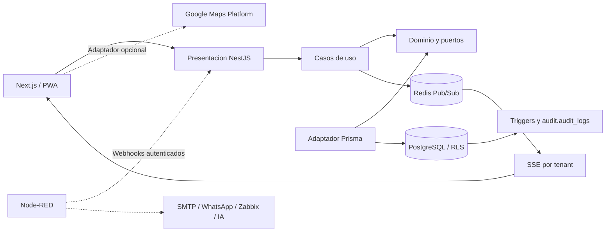
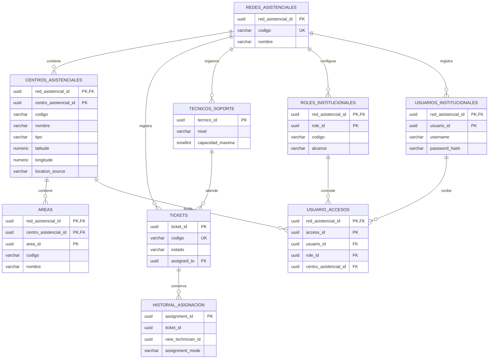

# EsSalud Ticket System

Proyecto académico y base para el piloto de soporte técnico e infraestructura de la Red Asistencial Pasco. No es un servicio oficial desplegado de EsSalud.

**Entrega actual: subetapa 3.4 — mapa opcional de sedes e incidencias.** Las subetapas anteriores fueron validadas por el usuario y la nube continúa pausada. [Guía local](docs/SUBETAPA-3.4.md); [evidencia y límites](docs/VALIDATION-3.4.md).

## Comenzar

- Si ya completaste 3.3: seguir [la guía local de 3.4](docs/SUBETAPA-3.4.md). Conservar el mismo repositorio, archivo de entorno y volúmenes.
- Si es una instalación nueva: Git, Node.js 24 y Docker Compose v2 con contenedores Linux. Desde esta carpeta, ejecutar los comandos siguientes uno por uno. Si alguno falla, detenerse y revisar su salida.

```sh
npm run env:init
npm run check
npm run infra:config
npm run infra:up
npm run infra:check
npm run db:backup
npm run db:migrate
npm run db:migrate
npm run db:status
npm run db:check
npm run db:audit:check
npm run db:organization:check
npm run db:access:check
npm run db:geography:check
```

En Windows se puede usar `npm.cmd` en lugar de `npm`. El generador conserva cualquier `.env` existente. Los scripts de infraestructura usan módulos nativos; el backend requiere instalar las dependencias del lockfile:

```sh
npm ci --ignore-scripts --no-audit --no-fund
npm run api:validate
npm run api:build
npm run api:test
npm run api:setup
npm run api:test:integration
npm run api:start
```

En otra terminal: `npm run api:check`. Swagger local: http://127.0.0.1:3001/docs. Las URLs de conexión están en apps/api/.env, ignorado por Git. Alternativa Docker y checklist: [SUBETAPA-1.4.md](docs/SUBETAPA-1.4.md).

Para mostrar el sistema completo en local, ejecutar `npm run tickets:setup`, `npm run demo:up` y `npm run demo:check`; abrir http://127.0.0.1:3000. El portal, el Kanban, `/organizacion` y `/mapa` usan PostgreSQL. Google Maps es opcional: sin clave, `/mapa` conserva la lista geográfica funcional.

## Qué contiene esta entrega

- PostgreSQL 17 y Redis 7.4 con volúmenes persistentes y healthchecks.
- Migración transaccional con bloqueo y registro SHA-256; repetirla no duplica objetos.
- Catálogo configurable de redes asistenciales, sedes, áreas y roles institucionales.
- UUID, códigos únicos por ámbito y claves foráneas compuestas.
- Roles de propietario, migración y runtime separados.
- RLS habilitado y forzado; lecturas y escrituras limitadas al contexto de red.
- Auditoría automática de INSERT, UPDATE y DELETE, con actor, solicitud, snapshots y timestamp.
- Historial protegido contra modificaciones del runtime y consultas limitadas a su red.
- Respaldo PostgreSQL en formato custom, 22 verificaciones de aislamiento y 34 de auditoría.
- Backend NestJS por capas, Prisma, runtime restringido y endpoints de salud/documentación.
- Portal Next.js y Kanban técnico conectados al CRUD local mediante un proxy que no expone la clave.
- Redis Pub/Sub y SSE por tenant, reconexión automática y refresco de React Query.
- Catálogo de técnicos por tenant, capacidad activa y asignación manual o automática con historial inmutable.
- Endpoint y vista de estructura organizacional con datos demo reemplazables por configuración.
- Identidades demo con hash scrypt, sesiones JWT breves en cookie HttpOnly y permisos por rol.
- Filtrado de tickets, eventos y catálogo por solicitante, sede o red, además del RLS por tenant.
- Coordenadas configurables por sede, auditadas y protegidas por RLS; mapa interactivo opcional y lista geográfica de respaldo.
- Workflow CI con regresión SQL, build, integración Prisma/Redis y demostración completa en contenedores.

La demostración ofrece tres cuentas ficticias para técnico, supervisor y administrador. El modo institucional rechaza este adaptador local y queda preparado para sustituirlo por el proveedor de identidad aprobado. Las mutaciones requieren `app.user_id`, `app.request_id` y tenant dentro de la misma transacción. [AUDIT.md](docs/AUDIT.md) documenta el contrato y los límites frente a administradores del esquema.

## Arquitectura prevista



NestJS y Prisma están implementados desde 1.4 y Next.js en 1.5; Node-RED se incorpora desde 4.2. El diagrama incluye componentes futuros. [API.md](docs/API.md) documenta las capas implementadas.



Las entidades del catálogo incluyen `activo`, `created_at` y `updated_at`. Las claves compuestas de los hijos preservan su jerarquía institucional. Los índices de PK y UNIQUE comienzan por la red en los hijos y sirven a las consultas por tenant.

## Estructura

```text
apps/api/src/{domain,application,infrastructure,presentation}/
apps/web/src/
packages/contracts/
infra/postgres/init/001-bootstrap.sql
infra/postgres/migrations/0001_multi_tenant.sql ... 0008_geographic_locations.sql
infra/postgres/verify.sql
infra/postgres/verify-multi-tenant.sql
infra/postgres/verify-audit.sql
infra/node-red/
scripts/lib/
scripts/db-{backup,migrate,status,check}.mjs
docs/
.github/workflows/ci.yml
compose.yaml
```

## Operación local

| Servicio | Desde el host | Desde la red Docker |
| --- | --- | --- |
| PostgreSQL | `127.0.0.1:55432` | `postgres:5432` |
| Redis | `127.0.0.1:56379` | `redis:6379` |

Base: `essalud_tickets`; administrador local: `bootstrap_admin`; claves en `.env`. El administrador solo se usa para herramientas de desarrollo y bootstrap. No será la credencial de la API.

`npm run infra:down` detiene sin borrar volúmenes. `npm run infra:logs` muestra diagnósticos. No usar `down --volumes` para actualizar el esquema. El SQL de `init/` solo se ejecuta en volúmenes nuevos; las migraciones funcionan sobre el volumen existente.

Si hay conflicto de puertos, cambiarlos en `.env`. Modificar la contraseña de `.env` no cambia la almacenada en un volumen PostgreSQL existente: requiere una rotación coordinada. Las imágenes usan etiquetas de rama; los digests se fijarán al preparar producción.

## Documentación

- [Guía de ejecución 1.3 y resultados esperados](docs/SUBETAPA-1.3.md).
- [Auditoría: contrato, campos, protección y alcance](docs/AUDIT.md).
- [Evidencia de validación 1.3](docs/VALIDATION-1.3.md).
- [Modelo, contexto tenant y límites de seguridad](docs/MULTI-TENANCY.md).
- [Git y publicación personal en GitHub](docs/GITHUB.md).
- [Cloud: preparación para 1.6](docs/CLOUD.md).
- [Estado de la hoja de ruta](docs/ROADMAP.md).
- [Guía de estructura organizacional 3.2](docs/SUBETAPA-3.2.md).
- [Guía de autenticación, RBAC y alcance 3.3](docs/SUBETAPA-3.3.md).
- [Guía de mapa opcional 3.4](docs/SUBETAPA-3.4.md).
- [Evidencia y límites de las pruebas](docs/VALIDATION.md).

Fuentes: [RLS en PostgreSQL 17](https://www.postgresql.org/docs/17/ddl-rowsecurity.html), [imagen oficial PostgreSQL](https://hub.docker.com/_/postgres) y [healthchecks Docker](https://docs.docker.com/compose/how-tos/startup-order/).
