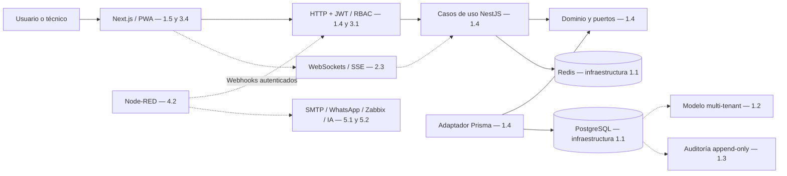

# EsSalud Ticket System

Proyecto académico y base para un piloto de soporte técnico, redes, infraestructura y mantenimiento biomédico en la Red Asistencial Pasco. No representa un servicio oficial desplegado de EsSalud.

**Entrega actual: subetapa 1.1 — repositorio e infraestructura local.** Contiene código completo de esta subetapa, PostgreSQL, Redis, SQL de preparación, automatización de verificación y documentación. La ejecución Docker y la publicación GitHub requieren completar las comprobaciones descritas abajo. Todavía no existen una aplicación web, endpoints ni tablas de tickets.

## Decisiones de arquitectura

Monorepositorio con Next.js y NestJS, ambos en TypeScript. Prisma será el adaptador de persistencia; el dominio y los casos de uso no dependerán de él. Usaremos Node.js 24 para las herramientas de esta entrega. Los paquetes de Next.js, NestJS y Prisma se incorporarán con sus versiones y lockfile en las subetapas 1.4 y 1.5.

PostgreSQL 17 y Redis 7.4 usan imágenes oficiales con etiquetas de rama. Reciben actualizaciones de parche: para el despliegue cloud se fijarán los digests probados. El volumen de PostgreSQL corresponde a la versión 17; cambiar de versión mayor requiere una migración.



El diagrama describe el destino y marca la subetapa de cada componente. Solo PostgreSQL y Redis se levantan en este Compose.

## Estructura

```text
essalud-ticket-system/
├── apps/
│   ├── api/src/
│   │   ├── domain/          # entidades y puertos
│   │   ├── application/     # casos de uso
│   │   ├── infrastructure/  # Prisma y adaptadores externos
│   │   └── presentation/    # controladores, DTO y transporte
│   └── web/src/            # Next.js en 1.5
├── packages/contracts/     # contratos públicos, sin entidades ORM
├── infra/
│   ├── postgres/init/      # SQL del primer arranque
│   ├── postgres/verify.sql # verificación transaccional
│   └── node-red/           # integración en 4.2
├── scripts/                # configuración y verificaciones
├── docs/                   # GitHub, cloud, decisiones y avance
├── .github/workflows/ci.yml
├── .env.example
├── compose.yaml
└── package.json
```

Las carpetas de las aplicaciones reservan la estructura; su código funcional corresponde a las subetapas 1.4 y 1.5.

## Arranque local (PowerShell, Linux o macOS)

Requisitos: Git, Node.js 24 y Docker con Compose v2 que soporte `up --wait`. En Windows, iniciar Docker Desktop con contenedores Linux. No se requiere instalar PostgreSQL o Redis en el host.

Desde la carpeta de este README:

```sh
node --version
docker compose version
docker info
npm run env:init
npm run check
npm run infra:config
npm run infra:up
npm run infra:check
npm run infra:status
```

Los scripts usan solo módulos nativos de Node.js; esta entrega no necesita `npm install`. Si PowerShell bloquea `npm.ps1`, sustituir `npm` por `npm.cmd` sin cambiar la política del sistema.

`env:init` crea dos contraseñas aleatorias y conserva cualquier `.env` existente. No imprime las contraseñas. No usar `.env.example` directamente como credenciales. `infra:config` verifica Compose sin mostrar los valores interpolados.

| Servicio | Desde el host | Desde un futuro contenedor de la misma red |
| --- | --- | --- |
| PostgreSQL | `127.0.0.1:55432` | `postgres:5432` |
| Redis | `127.0.0.1:56379` | `redis:6379` |

Base local: `essalud_tickets`. Usuario de bootstrap: `bootstrap_admin`. Contraseñas: `.env`. El usuario de bootstrap es superusuario de desarrollo; en 1.2 se separarán propietario, migrador y usuario restringido de la API antes de incorporar tráfico de aplicación.

El SQL inicial limita CREATE de PUBLIC en el schema public. El modelo relacional multi-tenant se implementa en 1.2 y la auditoría en 1.3, antes de la API de negocio. Los logs de Docker son diagnósticos y no sustituyen a los audit logs.

## Verificación y operación

`infra:up` espera los healthchecks. `infra:check` comprueba conexión PostgreSQL por TCP con contraseña, zona UTC, permisos base y escritura en una tabla temporal dentro de una transacción que se revierte; comprueba también Redis autenticado y el rechazo sin contraseña. Resultado esperado: `OK: PostgreSQL autenticado, SQL y permisos base; Redis PONG y rechazo sin clave.`

```sh
npm run infra:logs
npm run infra:down
```

Detener con `infra:down` conserva los volúmenes. Para comprobar persistencia operativa, arrancar nuevamente y repetir `infra:check`. No ejecutar `docker compose down --volumes` en un entorno con datos que se necesiten: elimina los volúmenes. CI lo usa exclusivamente para sus datos efímeros.

Si hay conflicto de puertos, cambiar `POSTGRES_PORT` o `REDIS_PORT` en `.env` y repetir el arranque. Si Docker no responde, iniciar su daemon. Si PostgreSQL informa contraseña incorrecta tras editar `.env`, el volumen conserva la contraseña original: restaurar la configuración o realizar una rotación con SQL. El SQL de `init/` solo se ejecuta al inicializar un volumen vacío; los cambios futuros de esquema serán migraciones versionadas.

GitHub Actions ejecuta las mismas verificaciones en un runner Linux. No tiene secretos de producción ni realiza despliegues. La existencia del workflow no implica que ya haya pasado: comprobar su ejecución después del push.

## GitHub y cloud

Consultar [comandos Git y publicación](docs/GITHUB.md), [preparación del despliegue cloud](docs/CLOUD.md), [decisión de arquitectura](docs/ADR-001.md) y [avance por subetapa](docs/ROADMAP.md).

La subetapa 1.1 se cierra cuando PostgreSQL y Redis pasan `infra:check`, existe el repositorio personal `essalud-ticket-system` y su CI está verde. El siguiente trabajo es 1.2, sin adelantar API, UI ni integraciones.

## Fuentes técnicas

- [Docker: healthchecks y orden de arranque](https://docs.docker.com/compose/how-tos/startup-order/).
- [Imagen oficial PostgreSQL: inicialización y volúmenes](https://hub.docker.com/_/postgres).
- [Imagen oficial Redis](https://hub.docker.com/_/redis).
- [GitHub CLI: crear un repositorio desde una carpeta](https://cli.github.com/manual/gh_repo_create).
