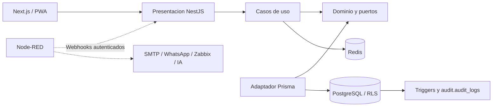
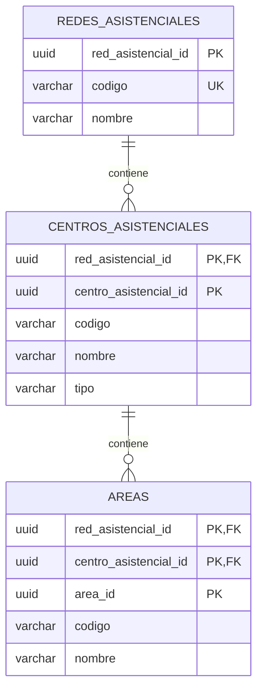

# EsSalud Ticket System

Proyecto académico y base para el piloto de soporte técnico e infraestructura de la Red Asistencial Pasco. No es un servicio oficial desplegado de EsSalud.

**Entrega actual: subetapa 1.4 — backend NestJS ejecutable.** La 1.3 fue verificada por el usuario en Docker. Esta entrega conserva ambas migraciones y agrega Prisma, transacciones por tenant, salud HTTP, Swagger, Dockerfile y pruebas. La validación Docker de 1.4 y CI están pendientes; ver [evidencia](docs/VALIDATION-1.4.md).

## Comenzar

- Si ya completaste 1.3: seguir [la guía paso a paso de 1.4](docs/SUBETAPA-1.4.md). Conservar el mismo repositorio, `.env` y volúmenes.
- Si es una instalación nueva: Git, Node.js 24 y Docker Compose v2 con contenedores Linux. Desde esta carpeta, ejecutar los comandos siguientes uno por uno. Si alguno falla, detenerse y revisar su salida.

```sh
npm run env:init
npm run check
npm run infra:config
npm run infra:up
npm run infra:check
npm run db:backup
npm run db:migrate
npm run db:migrate
npm run db:status
npm run db:check
npm run db:audit:check
```

En Windows se puede usar `npm.cmd` en lugar de `npm`. El generador conserva cualquier `.env` existente. Los scripts de infraestructura usan módulos nativos; el backend requiere instalar las dependencias del lockfile:

```sh
npm ci --ignore-scripts --no-audit --no-fund
npm run api:validate
npm run api:build
npm run api:test
npm run api:setup
npm run api:test:integration
npm run api:start
```

En otra terminal: `npm run api:check`. Swagger local: http://127.0.0.1:3001/docs. Las URLs de conexión están en apps/api/.env, ignorado por Git. Alternativa Docker y checklist: [SUBETAPA-1.4.md](docs/SUBETAPA-1.4.md).

## Qué contiene esta entrega

- PostgreSQL 17 y Redis 7.4 con volúmenes persistentes y healthchecks.
- Migración transaccional con bloqueo y registro SHA-256; repetirla no duplica objetos.
- Tres tablas: redes asistenciales, centros asistenciales y áreas.
- UUID, códigos únicos por ámbito y claves foráneas compuestas.
- Roles de propietario, migración y runtime separados.
- RLS habilitado y forzado; lecturas y escrituras limitadas al contexto de red.
- Auditoría automática de INSERT, UPDATE y DELETE, con actor, solicitud, snapshots y timestamp.
- Historial protegido contra modificaciones del runtime y consultas limitadas a su red.
- Respaldo PostgreSQL en formato custom, 22 verificaciones de aislamiento y 34 de auditoría.
- Backend NestJS por capas, Prisma, runtime restringido y endpoints de salud/documentación.
- Workflow CI con regresión SQL, build y pruebas HTTP, integración Prisma/Redis y contenedor API.

La creación de usuarios, autenticación JWT, roles institucionales y alcance por sede pertenecen a la etapa 3. La API base ya es ejecutable; el portal se implementará en 1.5. Las mutaciones del runtime ahora requieren app.user_id y app.request_id, además del tenant, dentro de la misma transacción. [AUDIT.md](docs/AUDIT.md) documenta el contrato y los límites frente a administradores del esquema.

## Arquitectura prevista



NestJS y Prisma están implementados en 1.4; Next.js se incorpora en 1.5 y Node-RED desde 4.2. El diagrama incluye componentes futuros. [API.md](docs/API.md) documenta las capas implementadas.



Cada tabla incluye `activo`, `created_at` y `updated_at`. Las claves compuestas de los hijos preservan su jerarquía institucional. La pertenencia debe conservarse también en futuras tablas de tickets. Los índices de PK y UNIQUE comienzan por la red en los hijos y sirven a las consultas por tenant.

## Estructura

```text
apps/api/src/{domain,application,infrastructure,presentation}/
apps/web/src/
packages/contracts/
infra/postgres/init/001-bootstrap.sql
infra/postgres/migrations/0001_multi_tenant.sql
infra/postgres/migrations/0002_audit_logs.sql
infra/postgres/verify.sql
infra/postgres/verify-multi-tenant.sql
infra/postgres/verify-audit.sql
infra/node-red/
scripts/lib/
scripts/db-{backup,migrate,status,check}.mjs
docs/
.github/workflows/ci.yml
compose.yaml
```

## Operación local

| Servicio | Desde el host | Desde la red Docker |
| --- | --- | --- |
| PostgreSQL | `127.0.0.1:55432` | `postgres:5432` |
| Redis | `127.0.0.1:56379` | `redis:6379` |

Base: `essalud_tickets`; administrador local: `bootstrap_admin`; claves en `.env`. El administrador solo se usa para herramientas de desarrollo y bootstrap. No será la credencial de la API.

`npm run infra:down` detiene sin borrar volúmenes. `npm run infra:logs` muestra diagnósticos. No usar `down --volumes` para actualizar el esquema. El SQL de `init/` solo se ejecuta en volúmenes nuevos; las migraciones funcionan sobre el volumen existente.

Si hay conflicto de puertos, cambiarlos en `.env`. Modificar la contraseña de `.env` no cambia la almacenada en un volumen PostgreSQL existente: requiere una rotación coordinada. Las imágenes usan etiquetas de rama; los digests se fijarán al preparar producción.

## Documentación

- [Guía de ejecución 1.3 y resultados esperados](docs/SUBETAPA-1.3.md).
- [Auditoría: contrato, campos, protección y alcance](docs/AUDIT.md).
- [Evidencia de validación 1.3](docs/VALIDATION-1.3.md).
- [Modelo, contexto tenant y límites de seguridad](docs/MULTI-TENANCY.md).
- [Git y publicación personal en GitHub](docs/GITHUB.md).
- [Cloud: preparación para 1.6](docs/CLOUD.md).
- [Estado de la hoja de ruta](docs/ROADMAP.md).
- [Evidencia y límites de las pruebas](docs/VALIDATION.md).

Fuentes: [RLS en PostgreSQL 17](https://www.postgresql.org/docs/17/ddl-rowsecurity.html), [imagen oficial PostgreSQL](https://hub.docker.com/_/postgres) y [healthchecks Docker](https://docs.docker.com/compose/how-tos/startup-order/).
