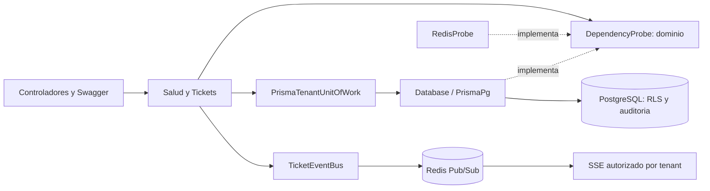

# Backend local — subetapa 2.4

NestJS 11, TypeScript estricto, Prisma 7 con adaptador PostgreSQL y Redis mediante ioredis. Versiones exactas y árbol reproducible en package-lock.json. Requiere Node.js 24 y npm con soporte de workspaces.

## Capas

- `src/domain`: invariantes de contexto y puerto de disponibilidad, sin NestJS ni Prisma.
- `src/application`: caso de uso que combina sondas y limita el tiempo de espera.
- `src/infrastructure`: configuración, pool PostgreSQL, Prisma, Redis y transacciones por tenant.
- `src/presentation`: HTTP versionado, DTO de salud, Swagger y errores públicos.
- `app.module.ts`: composición e inyección. `bootstrap.ts` permite iniciar y probar la aplicación; `main.ts` carga la configuración del proceso.

## Contrato HTTP

| Método y ruta | Resultado |
| --- | --- |
| GET `/api/v1` | Identificación, versión 0.6.0 y subetapa 2.4 |
| GET `/api/v1/health/live` | 200 si el proceso responde |
| GET `/api/v1/health/ready` | 200 si PostgreSQL y Redis están disponibles; 503 si falla una dependencia o el rol SQL es inseguro |
| GET `/docs` y `/docs-json` | Swagger UI y OpenAPI cuando SWAGGER_ENABLED=true |
| POST/GET `/api/v1/tickets` | Crear y listar tickets del tenant local |
| GET/PATCH/DELETE `/api/v1/tickets/:id` | Consultar, editar o eliminar un ticket |
| PATCH `/api/v1/tickets/:id/estado` | Aplicar una transición válida con motivo |
| GET `/api/v1/tickets/:id/estado/historial` | Consultar el historial inmutable de estados |
| GET `/api/v1/tickets/events` | Flujo SSE de cambios del tenant autorizado |
| GET `/api/v1/tickets/asignacion/tecnicos` | Técnicos activos, carga y capacidad del tenant |
| PATCH `/api/v1/tickets/:id/asignacion` | Asignación o reasignación manual con motivo |
| POST `/api/v1/tickets/:id/asignacion/automatica` | Asignación al técnico disponible con menor carga |
| GET `/api/v1/tickets/:id/asignacion/historial` | Historial cronológico e inmutable de asignaciones |

Los eventos SSE usan `event: ticket` y un cuerpo con `version`, `type`, `ticketId`, `requestId` y `occurredAt`. Las asignaciones publican `ticket.assignment_changed`. Hay heartbeats cada 15 segundos y una recomendación de reconexión de tres segundos. No existe replay en esta subetapa; el cliente vuelve a consultar el listado y las cargas al conectarse.

La sonda SQL comprueba permisos efectivos y RLS forzado en las ocho tablas existentes. Redis debe responder PONG. Las sondas no sustituyen las suites de integridad SQL. Readiness limita su espera a 2,5 segundos; liveness no consulta dependencias.

Cada solicitud recibe un UUID nuevo en `X-Request-Id`. Los errores no devuelven stack, consultas SQL ni configuración. Helmet agrega cabeceras de seguridad; CORS permite únicamente los orígenes configurados, sin credenciales. Los logs incluyen método, ruta sin query string, estado y duración; no registran cuerpos ni cabeceras. Swagger está desactivado por defecto en producción. CORS no es autenticación.

Los endpoints de tickets solo se habilitan con `TICKETS_LOCAL_ENABLED=true`, una clave local y una identidad fija validada en el servidor. La configuración rechaza este modo en producción y cloud. Los headers de tenant o usuario se ignoran como autoridad; JWT/RBAC siguen en 3.1.

## PostgreSQL y compatibilidad

Las migraciones 0001–0004 permanecen intactas. La 0005 añade técnicos, asignación y su historial. `npm run db:migrate` continúa siendo el único mecanismo DDL. El schema Prisma mapea las tablas existentes; **no ejecutar `prisma db push` ni `prisma migrate`**: no representan los CHECK, triggers, permisos y RLS institucionales.

`api:setup` genera `apps/api/.env` con una clave aleatoria separada y aprovisiona el LOGIN `essalud_api`, que hereda `essalud_app`. No altera el `.env` raíz. El SQL está en `scripts/lib/api-role.mjs`: se envía por stdin, no como argumento visible del proceso. Se ejecuta dentro de una transacción con bloqueo asesor. Repetir conserva las claves de la API. Un rol preexistente sin la marca del proyecto o con membresías inesperadas se rechaza. La API verifica permisos efectivos y rechaza usar superusuarios, propietarios, migradores o escritores de auditoría.

Prisma no representa el tipo PostgreSQL `name` como escalar nativo soportado. `db_session_user` y `db_effective_role` conservan ese tipo en SQL y se mapean como `Unsupported("name")`. Para leerlos, usar una consulta parametrizada con conversión `::text`; los demás campos de auditoría tienen consultas Prisma tipadas. No se modifica la base para acomodar al ORM.

`PrismaTenantUnitOfWork.run(context, operation)` valida UUIDs, abre una transacción interactiva y establece `app.red_asistencial_id`, `app.user_id` y `app.request_id` con `set_config(..., true)` sobre la misma conexión. La operación recibe el cliente de esa transacción. El commit conserva negocio y auditoría juntos; el rollback revierte ambos y el contexto local no pasa a la siguiente solicitud del pool.

El contexto debe venir de la futura capa de identidad autorizada. La validación UUID solo verifica forma. Los casos de negocio futuros introducirán sus puertos de repositorio sin depender de tipos Prisma; hoy este adaptador permanece dentro de infraestructura y las pruebas.

## Configuración

| Variable | Uso |
| --- | --- |
| DATABASE_URL | URL PostgreSQL del LOGIN restringido, nunca bootstrap_admin |
| REDIS_URL | URL Redis autenticada |
| HOST / PORT | 127.0.0.1:3001 local; 0.0.0.0 y puerto asignado en contenedor/cloud |
| NODE_ENV | development, test o production |
| CORS_ORIGINS | Orígenes exactos separados por comas |
| SWAGGER_ENABLED | true/false; por defecto false en producción |
| TICKETS_LOCAL_ENABLED / TICKETS_LOCAL_KEY | Habilitación y clave del CRUD exclusivamente local |
| TICKETS_LOCAL_RED_ID / TICKETS_LOCAL_USER_ID | Identidad ficticia fija del servidor local |

Mantener copia privada de ambos `.env`. api:setup conserva un archivo existente: si cambian puertos o credenciales de infraestructura, actualizar de forma coordinada las URLs de apps/api/.env y reiniciar. Las claves generadas del LOGIN son hexadecimales; el script rechaza formatos ajenos. No compartir URLs con claves ni archivos .env.

## Pruebas

`api:test` ejecuta lógica y HTTP con sondas sustituidas. `api:test:integration` crea un proyecto Compose con nombre aleatorio y puertos libres: aplica dos veces las migraciones, ejecuta las cinco suites SQL, aprovisiona el LOGIN dos veces y prueba Prisma con PostgreSQL y Redis reales. Comprueba aislamiento, auditoría, CRUD, estados, asignación concurrente con capacidad, historial, Redis Pub/Sub entre instancias y salud HTTP. Elimina exclusivamente ese proyecto desechable al terminar. No copia datos institucionales a pruebas.

Si se interrumpe abruptamente, puede quedar el proyecto temporal; su nombre aparece al comienzo. Limpiarlo solo con el comando que incluye ese nombre, nunca usando el proyecto local con `down --volumes`.

Fuentes de diseño: [módulos NestJS](https://docs.nestjs.com/modules), [OpenAPI](https://docs.nestjs.com/openapi/introduction), [transacciones Prisma](https://www.prisma.io/docs/orm/prisma-client/queries/transactions) y [PGlite Socket, usado solo para validación auxiliar](https://pglite.dev/docs/pglite-socket).
