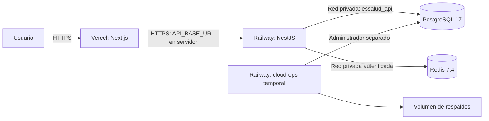

# Subetapa 1.6 — Vercel y Railway

Arquitectura original conservada: Vercel para Next.js y Railway para API, PostgreSQL, Redis y operaciones. Para el cierre actual aplicar [CIERRE-ETAPA-3.md](CIERRE-ETAPA-3.md).

## Arquitectura



El piloto actual incluye CRUD, SSE, autenticación/RBAC, organización, mapa y datos DEMO. Node-RED y los módulos de Etapa 4 continúan fuera de alcance.

## 1. Crear las cuentas

Crear personalmente las cuentas en [Vercel](https://vercel.com/signup) y [Railway](https://railway.com/login), con acceso al GitHub del repositorio. Completar sus condiciones y revisar el plan antes de contratar. Usar dominios del proveedor evita comprar un dominio propio, pero no implica que toda la infraestructura sea gratuita.

Crear en Railway el proyecto essalud-ticket-system, con un entorno dedicado al piloto y sus servicios en la misma región. No reutilizar una base de otro proyecto. Publicar el commit de 1.6 solo después de CI en verde. Habilitar la espera de CI en el proveedor cuando esté disponible. No activar autodespliegues antes de validar la configuración inicial.

## 2. PostgreSQL 17 privado

Añadir un servicio Docker Image `postgres:17-alpine`, nombre **Postgres**. Antes de desplegar, montar un volumen en `/var/lib/postgresql/data` y establecer:

| Variable | Valor |
| --- | --- |
| POSTGRES_DB | `railway` |
| POSTGRES_USER | `postgres` |
| POSTGRES_PASSWORD | Clave hexadecimal propia del servicio |
| PGHOST | `${{RAILWAY_PRIVATE_DOMAIN}}` |
| PGPORT | `5432` |
| PGDATABASE | `${{POSTGRES_DB}}` |
| PGUSER | `${{POSTGRES_USER}}` |
| PGPASSWORD | `${{POSTGRES_PASSWORD}}` |

Generar una clave en tu CMD local, copiarla solo al administrador de secretos del proveedor y guardarla en tu gestor de contraseñas:

```bat
node -e "console.log(require('node:crypto').randomBytes(32).toString('hex'))"
```

Generar claves distintas para PostgreSQL, Redis y el rol runtime. No enviarlas al chat ni subirlas a Git. No añadir dominio público ni TCP Proxy a Postgres. Desplegar y esperar que PostgreSQL acepte conexiones. No cambiar la versión mayor sobre un volumen ya inicializado.

## 3. Redis privado

Añadir servicio Docker Image `redis:7.4-alpine`, nombre **Redis**; volumen `/data`; variable REDIS_PASSWORD con otra clave hexadecimal. Establecer este Start Command literal, sin pegar la clave:

```sh
sh -ec 'exec redis-server --appendonly yes --requirepass "$REDIS_PASSWORD"'
```

Desplegar sin dominio público ni TCP Proxy. Esperar que acepte conexiones. La API utiliza PING autenticado.

## 4. Migraciones y restauración

Crear **cloud-ops** desde el repositorio GitHub. Root Directory vacío (raíz del monorepo), Config File `/infra/cloud/railway-ops.json`. Seleccionar explícitamente esta ruta en Settings; Railway no la descubre automáticamente en infra. No sobrescribir Start Command ni añadir healthcheck, dominio o comando previo al despliegue. Desactivar autodespliegues: se ejecuta manualmente antes de la API, una réplica y una ejecución a la vez.

Montar volumen en `/backups`. El punto de entrada ajusta solo ese directorio y ejecuta Node como usuario sin privilegios. Variables:

| Variable | Valor |
| --- | --- |
| CLOUD_ADMIN_DATABASE_URL | `postgresql://${{Postgres.PGUSER}}:${{Postgres.PGPASSWORD}}@${{Postgres.PGHOST}}:${{Postgres.PGPORT}}/${{Postgres.PGDATABASE}}` |
| CLOUD_DATABASE_NAME | `${{Postgres.PGDATABASE}}` |
| CLOUD_RUNTIME_PASSWORD | Tercera clave hexadecimal de 64 caracteres |
| CLOUD_BACKUP_DIR | `/backups` |

Las referencias suponen exactamente los nombres Postgres y Redis. El hostname debe terminar en .railway.internal. El transporte rechaza URLs públicas y bases distintas de CLOUD_DATABASE_NAME. Los scripts db:* conservan su transporte local y no se usan para Railway.

Desplegar y comprobar estas tres líneas finales:

```text
OK: migraciones, rol repetible y ocho suites SQL de seguridad y negocio.
OK: respaldo restaurado en base temporal, ocho suites repetidas y base temporal eliminada.
OK: evidencia y dos respaldos conservados en CLOUD_BACKUP_DIR. Operaciones finalizadas.
```

El código de salida 0 y el estado detenido/completado son esperados. Conserva dumps antes/después y evidencia verified-*.json. Aplica migraciones y rol dos veces, ejecuta ambas suites, restaura en una base temporal generada con propietarios y permisos, repite las suites y elimina únicamente esa base temporal.

Si falla, no desplegar API. Corregir la fase indicada y repetir con la misma clave runtime. Si se cambia, actualizar también DATABASE_URL de la API. Los tests revierten sus datos ficticios. Ejecutar sobre el piloto dedicado, inicialmente sin tráfico de negocio; no ejecutar varias instancias simultáneas.

Configurar respaldos periódicos de PostgreSQL y del volumen /backups en Railway según el plan. Confirmar al menos un respaldo correcto y conservar una copia descargada fuera del proyecto. Los dumps contienen datos: no van a Git. Esta restauración usa los roles del mismo clúster; recuperar en otro requiere recrear antes los roles y sus secretos. No equivale a una recuperación total del proveedor.

## 5. API con HTTPS

Crear **api** desde el mismo repositorio, Root Directory vacío y Config File `/infra/cloud/railway-api.json`. No sobrescribir Start Command. Variables:

| Variable | Valor |
| --- | --- |
| NODE_ENV | `production` |
| HOST | `::` |
| PORT | `3001` |
| SWAGGER_ENABLED | `false` |
| DATABASE_URL | `postgresql://essalud_api:CLAVE_RUNTIME@${{Postgres.PGHOST}}:${{Postgres.PGPORT}}/${{Postgres.PGDATABASE}}` |
| REDIS_URL | `redis://:${{Redis.REDIS_PASSWORD}}@${{Redis.RAILWAY_PRIVATE_DOMAIN}}:6379/0` |
| CORS_ORIGINS | Vacío primero; después origen HTTPS exacto de Vercel |

Reemplazar CLAVE_RUNTIME por la clave de cloud-ops únicamente en el campo secreto del proveedor. No usar el usuario postgres en la API ni añadirle CLOUD_ADMIN_DATABASE_URL. Desactivar la suspensión/serverless de la API para mantenerla persistente.

Desplegar después de operaciones exitosas. Railway espera 200 en /api/v1/health/ready hasta 120 segundos. En Networking → Public Networking → Generate Domain, elegir puerto destino 3001. Guardar la URL HTTPS asignada. Abrir /api/v1/health/ready: status ok y ambas dependencias up. /docs y /docs-json deben responder 404.

## 6. Vercel

Importar el repositorio, elegir Next.js, Root Directory **apps/web**, Node.js **24.x** y habilitar archivos fuera de Root Directory. apps/web/vercel.json utiliza el lockfile raíz, instala solo el workspace web y ejecuta su build. Conservar Output Directory por defecto; no usar export estático.

Añadir **API_BASE_URL** en Production con la URL HTTPS pública de API, sin /api/v1 ni barra final. Es variable de servidor, sin NEXT_PUBLIC_. Desplegar el commit aprobado y guardar su dominio de producción. Ese dominio debe abrirse sin login de Vercel; los previews pueden mantener protección.

En Railway → api establecer CORS_ORIGINS con el origen exacto de producción Vercel, sin barra final. Redesplegar y esperar readiness. No usar comodín para previews. Abrir /portal y /tecnico; comprobar el indicador de API disponible.

## 7. Verificar HTTPS y persistencia

En CMD local reemplazar los ejemplos con los orígenes reales:

```bat
set "CLOUD_WEB_URL=https://TU-PROYECTO.vercel.app"
set "CLOUD_API_URL=https://TU-API.up.railway.app"
npm.cmd run cloud:check
```

Exige certificado válido, redirección HTTP → HTTPS, contrato de salud, identidad API, Swagger oculto, CORS exacto, ambas páginas y conexión frontend → API. No configurar NODE_TLS_REJECT_UNAUTHORIZED=0. Guardar salida, fecha, URLs y commit desplegado. Solo acredita el estado observado en ese momento.

Reiniciar Postgres y Redis conservando volúmenes; esperar recuperación, repetir cloud-ops con la misma clave y cloud:check. Confirmar historial de migraciones y respaldos anteriores presentes en /backups. Cerrar 1.6 únicamente cuando CI, operaciones, restauración, respaldo periódico, reinicio y las 12 verificaciones HTTPS pasen.

## Fuentes oficiales

[Configuración Railway](https://docs.railway.com/config-as-code/reference), [Redis dual stack](https://docs.railway.com/databases/troubleshooting/enotfound-redis-railway-internal), [PostgreSQL](https://docs.railway.com/databases/postgresql), [volúmenes](https://docs.railway.com/volumes), [dominios y SSL](https://docs.railway.com/networking/public-networking), [monorepositorios Vercel](https://vercel.com/docs/monorepos).

Se mantiene el piloto con datos ficticios y los dominios asignados por los proveedores. No se contratan servicios en esta entrega ni se amplían las etapas 2–5.
