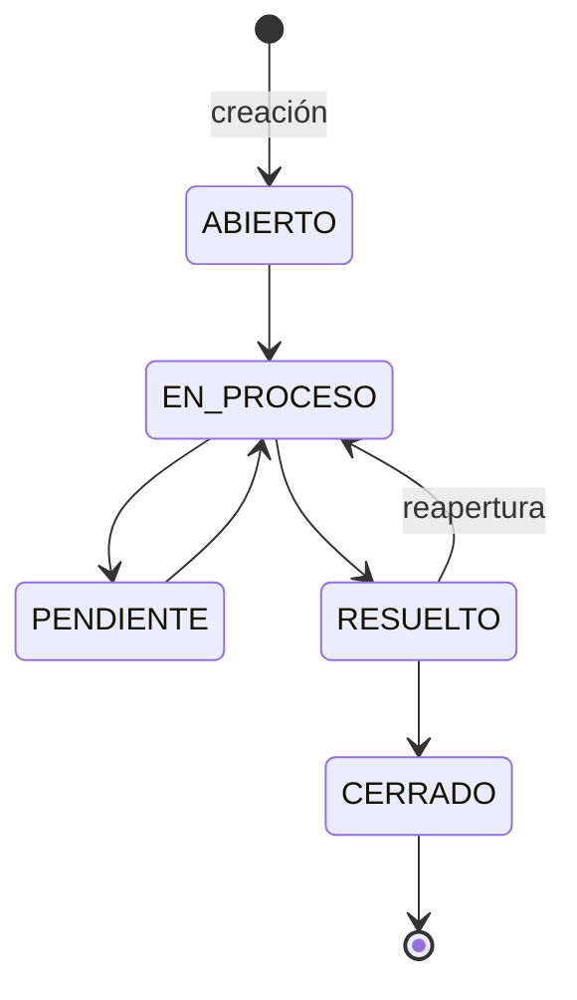

# Subetapa 2.2 — máquina de estados de tickets

La subetapa 2.1 fue validada por el usuario. Esta entrega continúa en `main`, funciona exclusivamente en Docker Compose local y no reactiva Railway ni Vercel. No incluye tiempo real, asignaciones, JWT ni RBAC.

## Flujo permitido



No se permiten saltos, transiciones al mismo estado ni salidas desde `CERRADO`. Cada transición exige un motivo de 5 a 500 caracteres. `RESUELTO` registra `resolvedAt`; una reapertura la limpia; `CERRADO` conserva `resolvedAt` y registra `closedAt`.

## Arranque y migración en CMD

Abre Docker Desktop y espera que el motor Linux esté listo. Ejecuta cada línea por separado y detente ante cualquier error:

```bat
cd /d "C:\Users\Stev\Pictures\SISTEMA DE TICKET\essalud-ticket-system"
git branch --show-current
npm.cmd run tickets:down
npm.cmd run check
npm.cmd run infra:up
npm.cmd run infra:check
npm.cmd run db:backup
npm.cmd run db:migrate
npm.cmd run db:migrate
npm.cmd run db:status
npm.cmd run db:check
npm.cmd run db:audit:check
npm.cmd run db:tickets:check
npm.cmd run db:ticket-states:check
npm.cmd run api:setup
npm.cmd run tickets:setup
npm.cmd run tickets:up
npm.cmd run api:check
npm.cmd run tickets:check
```

`tickets:down` conserva los volúmenes. Si informa que no había servicios activos, puedes continuar. El historial debe mostrar `0004_ticket_state_machine`; la segunda migración debe indicar `SKIP`. Las verificaciones SQL deben aprobar 22 controles multi-tenant, 34 de auditoría, 20 del CRUD y 23 de estados. `tickets:check` recorre CRUD, transiciones válidas, saltos rechazados e historial.

## API local

Se conservan los cinco endpoints CRUD de 2.1 y se añaden:

| Método | Ruta | Uso |
| --- | --- | --- |
| PATCH | `/api/v1/tickets/:id/estado` | Cambiar estado con `estado` y `motivo` |
| GET | `/api/v1/tickets/:id/estado/historial` | Consultar apertura y transiciones en orden cronológico |

Ejemplo de transición:

```json
{
  "estado": "EN_PROCESO",
  "motivo": "Atención técnica iniciada"
}
```

Una transición válida responde `200`. Un salto o una transición repetida responde `409`; datos inválidos responden `400`; un ticket inexistente o de otra red responde `404`. Ambos endpoints requieren `X-Local-Api-Key`, igual que el CRUD de 2.1.

El historial contiene `estadoAnterior`, `estadoNuevo`, `motivo`, `changedBy`, `requestId` y `changedAt`. La creación produce automáticamente el evento inicial `null → ABIERTO`. El runtime solo puede leer este historial: los triggers bloquean su modificación y también una mutación administrativa ordinaria. No tiene FK al ticket para que sobreviva a una eliminación física.

La migración incorpora los tickets abiertos que ya existan desde 2.1 y recupera el actor y `requestId` de su evento de auditoría original. Si encuentra un ticket sin ese rastro obligatorio, se detiene para evitar inventar identidad o perder trazabilidad.

PostgreSQL bloquea la fila durante cada transición. Dos solicitudes concurrentes que intenten tomar el mismo ticket desde `ABIERTO` producen una transición exitosa y un `409`, sin dos eventos válidos para el mismo cambio. La validación también vive en un trigger, por lo que una escritura directa no puede saltar la secuencia permitida.

## Pruebas esenciales

```bat
npm.cmd run api:build
npm.cmd run api:test
npm.cmd run api:test:integration
```

La última prueba usa infraestructura Docker desechable, aplica las cuatro migraciones dos veces y prueba PostgreSQL/Redis reales, autenticación SCRAM, RLS, auditoría, toda la máquina de estados y la carrera concurrente. No utiliza ni elimina los volúmenes locales del proyecto.

## Verificación manual importante

1. Abre `http://127.0.0.1:3001/docs` y autoriza `local-key` con `TICKETS_LOCAL_KEY` de `apps/api/.env.tickets`; no compartas esa clave.
2. Crea un ticket ficticio según la guía 2.1 y copia su `ticketId`.
3. Intenta `ABIERTO → CERRADO`: debe responder `409`.
4. Ejecuta `ABIERTO → EN_PROCESO → PENDIENTE → EN_PROCESO → RESUELTO → CERRADO`, siempre con motivos. Comprueba `resolvedAt` y `closedAt`.
5. Consulta el historial: debe contener la apertura y las cinco transiciones. Desde `CERRADO`, intenta volver a `EN_PROCESO`: debe responder `409`.

## Guardar en la misma rama

Después de aprobar Docker y la verificación manual:

```bat
git branch --show-current
git diff --check
git add package.json package-lock.json .github/workflows/ci.yml README.md docs/API.md docs/ROADMAP.md docs/SUBETAPA-2.2.md docs/VALIDATION-2.2.md apps/api/prisma/schema.prisma apps/api/src/domain/ticket.ts apps/api/src/application/tickets.ts apps/api/src/infrastructure/database.ts apps/api/src/infrastructure/ticket-repository.ts apps/api/src/presentation/tickets.controller.ts apps/api/src/presentation/tickets.dto.ts apps/api/test/unit/tickets.test.cjs apps/api/test/integration/tickets-flow.cjs infra/postgres/migrations/0004_ticket_state_machine.sql infra/postgres/verify-ticket-states.sql infra/postgres/verify-tickets.sql scripts/api-integration.mjs scripts/db-ticket-states-check.mjs scripts/tickets-check.mjs
git diff --cached --stat
git commit -m "feat(tickets): add audited ticket state machine"
```

No se crea otra rama ni se realiza `push` automáticamente. No avanzar a 2.3 hasta aprobar esta checklist.
