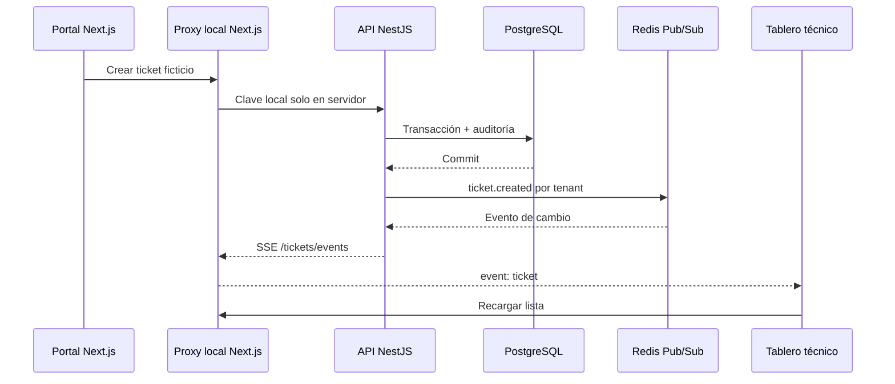

# Subetapa 2.3 — tablero de tickets en tiempo real

La subetapa 2.2 fue validada por el usuario. Esta entrega continúa en `main`, usa únicamente Docker Compose local y mantiene Railway y Vercel pausados.

## Funcionamiento



El API publica `ticket.created`, `ticket.updated`, `ticket.state_changed` y `ticket.deleted` después de que la operación termina correctamente. Redis distribuye los eventos entre instancias y el endpoint SSE entrega únicamente los eventos de la red autorizada. El evento contiene versión, tipo, `ticketId`, `requestId` y fecha; no incluye descripción ni información sensible.

Next.js mantiene `TICKETS_LOCAL_KEY` y los UUID del catálogo en el servidor. El navegador utiliza `/api/tickets` y `/api/tickets/events`, sin recibir esas claves. SSE se reconecta automáticamente y, al recuperar la conexión, React Query vuelve a consultar PostgreSQL para cubrir eventos ocurridos durante el corte.

## Despliegue local completo en CMD

Abre Docker Desktop y espera a que indique que el motor está listo. Ejecuta cada línea por separado:

```bat
cd /d "C:\Users\Stev\Pictures\SISTEMA DE TICKET\essalud-ticket-system"
git branch --show-current
npm.cmd run env:init
npm.cmd run check
npm.cmd run infra:up
npm.cmd run infra:check
npm.cmd run db:migrate
npm.cmd run db:status
npm.cmd run tickets:setup
npm.cmd run demo:config
npm.cmd run demo:up
npm.cmd run demo:status
npm.cmd run demo:check
```

La rama debe ser `main`. `db:status` debe incluir `0001` a `0004`; esta subetapa no necesita una migración nueva. `demo:status` debe mostrar `postgres`, `redis`, `api` y `web` como `healthy`. `demo:check` crea un ticket ficticio, observa por SSE su creación y cambio de estado, comprueba su persistencia y lo elimina al terminar.

Abre las dos vistas:

```bat
start http://127.0.0.1:3000/portal
start http://127.0.0.1:3000/tecnico
```

Para revisar un problema:

```bat
npm.cmd run demo:status
npm.cmd run demo:logs
```

Para detener la demostración sin borrar PostgreSQL ni Redis:

```bat
npm.cmd run demo:down
```

No uses `down --volumes`: eliminaría los datos locales. Ninguno de estos comandos reactiva los despliegues cloud.

## Demostración para el supervisor

1. Coloca `/portal` y `/tecnico` en dos ventanas visibles. Espera `API disponible` y `Tiempo real activo`.
2. En el portal, crea una solicitud usando únicamente datos ficticios. Debe recibir un código `INC-2026-XXXX`.
3. Sin recargar el tablero técnico, comprueba que aparece en la columna **Abierto**.
4. Abre la tarjeta, selecciona **En Proceso**, escribe un motivo y guarda. La tarjeta debe cambiar de columna en ambas ventanas sin recarga manual.
5. Recarga el navegador: el ticket debe continuar visible porque está guardado en PostgreSQL.
6. Puedes continuar por las transiciones permitidas de 2.2. Los intentos de salto siguen bloqueados por la API y PostgreSQL.

## Pruebas esenciales

```bat
npm.cmd run api:build
npm.cmd run api:test
npm.cmd run web:check
npm.cmd run web:test
npm.cmd run web:build
npm.cmd run web:smoke
npm.cmd run api:test:integration
npm.cmd run demo:check
git diff --check
```

La integración desechable verifica Redis Pub/Sub entre dos instancias y aislamiento de tenant. `demo:check` valida la cadena navegador/proxy/API/PostgreSQL/Redis/SSE usando los contenedores locales.

## Guardar en la misma rama

Después de aprobar Docker y la demostración manual:

```bat
git status --short
git diff --check
git add .github/workflows/ci.yml README.md package.json package-lock.json compose.demo.yaml apps/api apps/web scripts/api-check.mjs scripts/demo-check.mjs scripts/web-smoke.mjs docs/API.md docs/ROADMAP.md docs/SUBETAPA-2.3.md docs/VALIDATION-2.3.md
git diff --cached --stat
git commit -m "feat(realtime): stream tenant ticket updates to local board"
```

No avanzar a 2.4 hasta completar esta guía.
