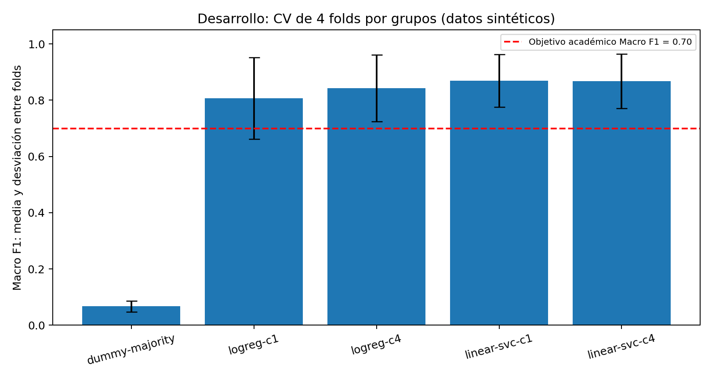
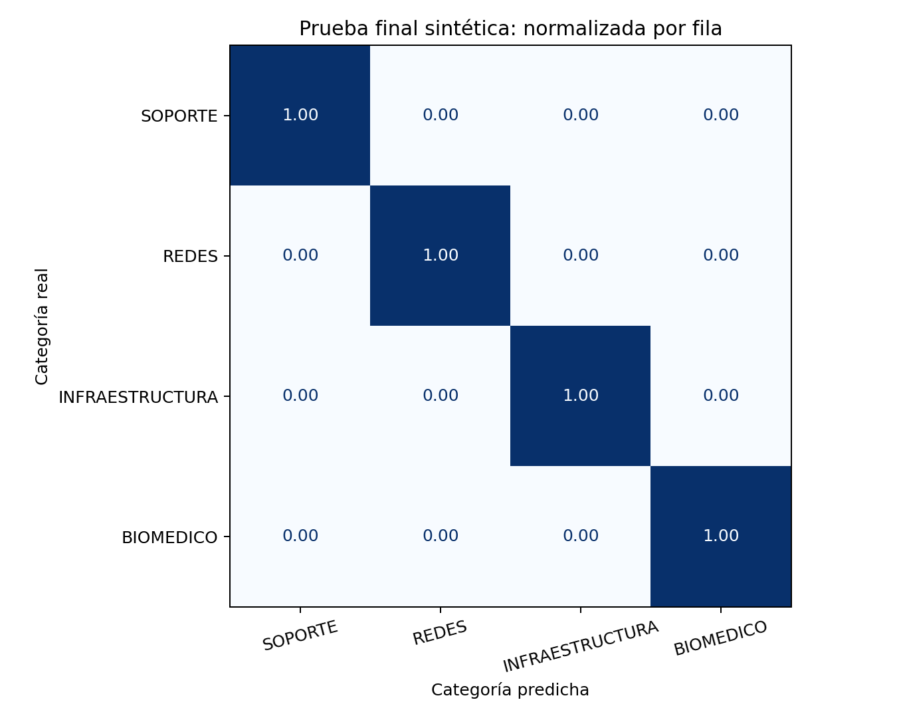

# Experimento 4.4 — resultados reales

SYNTHETIC / DEMO / ACADEMIC DATASET. Sin validación institucional.

Candidato elegido solo con CV: `linear-svc-c1`. Estado: **EXPERIMENTAL_CANDIDATE_ACCEPTED**.

160 registros de desarrollo; 40 de prueba final, 10 por categoría. Grupos indivisibles; cuatro folds congelados. Solo título y descripción entran al clasificador.

## Comparación de desarrollo

| Candidato | Macro F1 media | Desviación | Accuracy OOF |
| --- | ---: | ---: | ---: |
| dummy-majority | 0.0670 | 0.0196 | 0.1562 |
| logreg-c1 | 0.8074 | 0.1451 | 0.8063 |
| logreg-c4 | 0.8428 | 0.1193 | 0.8375 |
| linear-svc-c1 | 0.8690 | 0.0939 | 0.8688 |
| linear-svc-c4 | 0.8671 | 0.0968 | 0.8688 |

Selección: Eligibility gates first; CV mean/variability and predeclared algorithm/lower-C preference. Candidatos cercanos: linear-svc-c1, linear-svc-c4.

## Prueba final

Accuracy: 1.0000; Macro F1: 1.0000; F1 ponderado: 1.0000.

| Categoría | Precision | Recall | F1 | Soporte |
| --- | ---: | ---: | ---: | ---: |
| SOPORTE | 1.0000 | 1.0000 | 1.0000 | 10 |
| REDES | 1.0000 | 1.0000 | 1.0000 | 10 |
| INFRAESTRUCTURA | 1.0000 | 1.0000 | 1.0000 | 10 |
| BIOMEDICO | 1.0000 | 1.0000 | 1.0000 | 10 |

Criterios CV: True; criterios prueba: True; promoción experimental: True.

## Aciertos y errores

El CSV final-examples incluye los 40 textos, etiquetas, predicciones y scores; final-errors contiene los fallos. Las razones automáticas son hipótesis para revisar, no explicaciones causales.

- ML-0001: SOPORTE → SOPORTE; acierto=True. Acierto; comprobar evidencia textual con guía
- ML-0002: SOPORTE → SOPORTE; acierto=True. Acierto; comprobar evidencia textual con guía
- ML-0003: SOPORTE → SOPORTE; acierto=True. Acierto; comprobar evidencia textual con guía
- ML-0004: SOPORTE → SOPORTE; acierto=True. Acierto; comprobar evidencia textual con guía

## Limitaciones

Corpus sintético pequeño con una sola fuente asistida y sin revisión humana independiente. Los 200 registros no son 200 escenarios independientes. Con 10 casos por clase, un error cambia recall en 0.10. La desviación entre folds no es un intervalo de confianza. Probabilidades logísticas sin calibrar; márgenes SVM no son probabilidades. No se fijó un umbral operativo; la curva de cobertura solo usa OOF de desarrollo. No modificar datos, grupos o parámetros tras observar la prueba. Un fallo de criterios debe documentarse antes de considerar 4.5.

No se exporta modelo ni se crean servicios; 4.5 requiere autorización. GitHub/Colab deben registrar por separado dónde se ejecutó el experimento.
